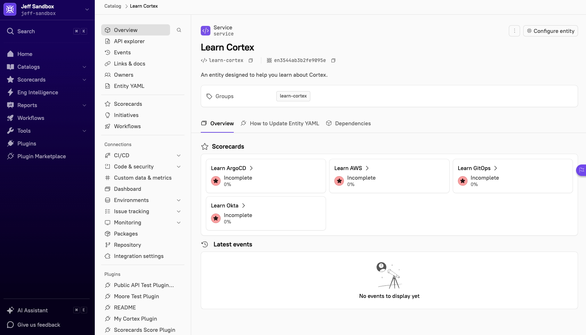
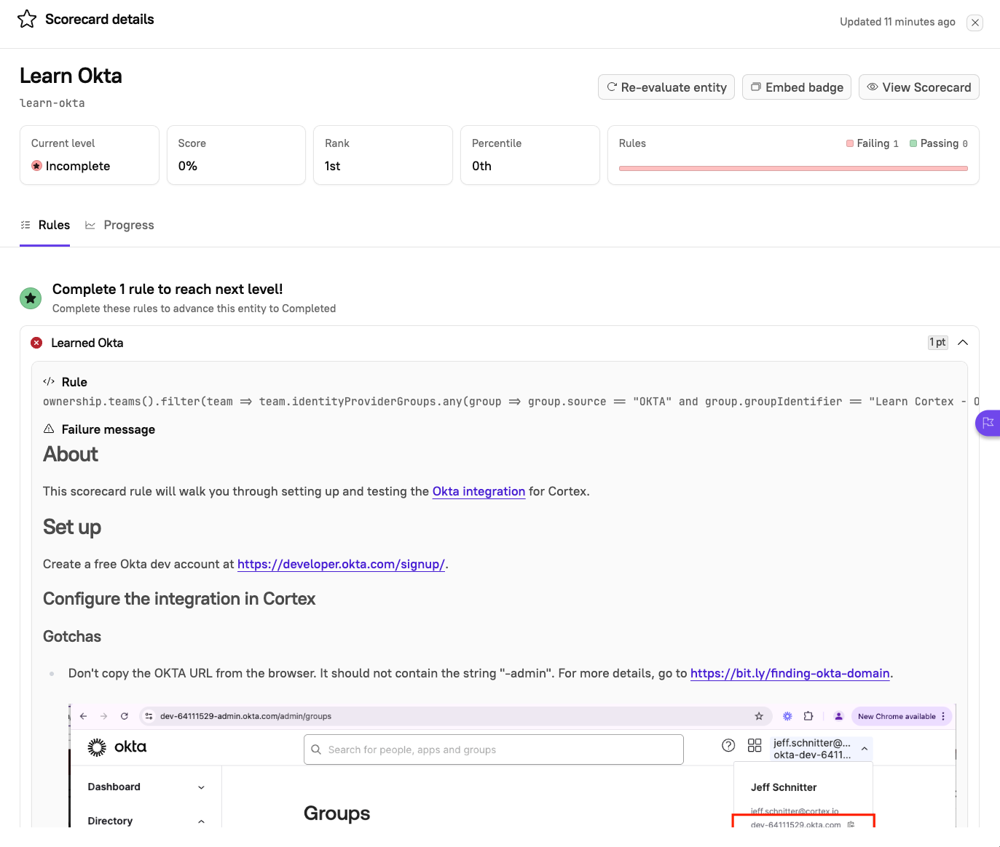

# learn-cortex
Repository for setting up test entities and learning how to use Cortex.

We're just kicking the tires on this and have limited content, but if you want to give it try please follow
the directions listed below.

# Pre-requistites
- A Cortex instance.
- The Command prompt (on a Mac: Finder -> Applications -> Utilities -> Terminal)
- a folder on your computer to clone the learn-cortex repository to
- [Homebrew](https://brew.sh/) installed
    
    **TL;DR**

    This command will install homebrew if you don't already have it installed.
    ```
    which brew > /dev/null || /bin/bash -c "$(curl -fsSL https://raw.githubusercontent.com/Homebrew/install/HEAD/install.sh)"
    ```


# Installation
- If needed, create a folder on your computer to store repositories (such as ~/Repos)
  
    ```
    mkdir ~/Repos
    ```
- Install git

    ```
    brew install git
    ```

- Navigate to your repository folder, and clone the learn-cortex repository

    ```
    cd ~/Repos
    git clone https://github.com/cortexapps/learn-cortex.git
    ```

- This repository uses [just](https://github.com/casey/just) to run the set up tasks

    ```
    brew install just
    ```

- install the cortex CLI (required to setup Justfile)

    ```
    brew tap cortexapps/tap
    brew install cortexapps-cli
    ```

- Create a Cortex personal token following the steps in https://docs.cortex.io/docs/walkthroughs/workspace-settings/personal-tokens, and then set environment variable CORTEX_API_KEY with the token value

    ```
    export CORTEX_API_KEY=<your personal token>
    ```

- set environment variable CORTEX_EMAIL with email that will be used as the owner of the Learn Cortex entity

    ```
    export CORTEX_EMAIL=joe@example.com
    ```

- Create a Github personal access token following the steps in https://docs.github.com/en/authentication/keeping-your-account-and-data-secure/managing-your-personal-access-tokens, and then set environment variable GH_PAT with the token value

    ```
    export GH_PAT=<your personal access token>
    ```

- Navigate to the newly-cloned learn-cortex folder and run just setup

    ```
    cd learn-cortex
    just setup
    ```


# The Learn Cortex entity
You will now have an entity named Learn Cortex in your catalog. 



Click on the 'Learn Okta' scorecard and expand the failing Scorecard rule
to see instructions on how to set up a dev instance of Okta.



# Contributing
It is hoped that this will be a group-sourced project.  Please fix any errors and add new content using the available workflows
in your sandbox.

# Workflows
There are several workflows that will be available from the Learn Cortex entity:
- **Learn Cortex - create Scorecard**

    This will create a Learn Cortex scorecard from a template in your sandbox.  The intent is that you would add markdown
    to the CQL rule in the Learned level to help educate users on a topic.

- **Learn Cortex - publish Scorecard**

    This will publish a Learn Cortex scorecard from your sandbox to git.
    A Slack message will be posted to #learn-cortex alerting users to new content in the repository.

- **Learn Cortex - install Scorecard**

    Install a Learn Cortex scorecard from the learn-cortex repository.  This allows you to add new content using a workflow.
    Alternatively, you can run update your git checkout and run 'just'.
